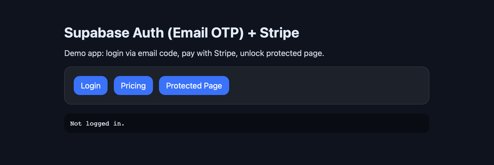

# Tiny SaaS Starter



**[Supabase](https://supabase.com)** OTP + Stripe Checkout (Minimal)

## Flow

1. Login via OTP → Supabase session
2. Pay via Stripe Checkout
3. Webhook confirms payment → unlock `Protected Page`

---

## Requirements

- Docker
- Supabase CLI
- Node.js
- Stripe account + Stripe CLI

---

## Quick Start

```bash
# clone this repo
git clone https://github.com/miroslavpejic85/saas.git

# go to saas dir
cd saas

# Install CLI (npm)
npm i -g supabase

# Start local stack
supabase start
supabase db reset
```

---

## Configure env

```bash
# Copy and edit it
cp .env.example .env
```

---

## Stripe webhook (local)

```bash
# Login to your stripe dashboard
stripe login

# Copy `whsec_...` → `.env` as `STRIPE_WEBHOOK_SECRET`
stripe listen --events checkout.session.completed --forward-to localhost:3000/stripe/webhook
```

---

## Run the app

```bash
npm ci
npm run dev
```

Local URLs:

- App: http://localhost:3000
- Mailpit: http://127.0.0.1:54324
- Studio: http://127.0.0.1:54323

---
